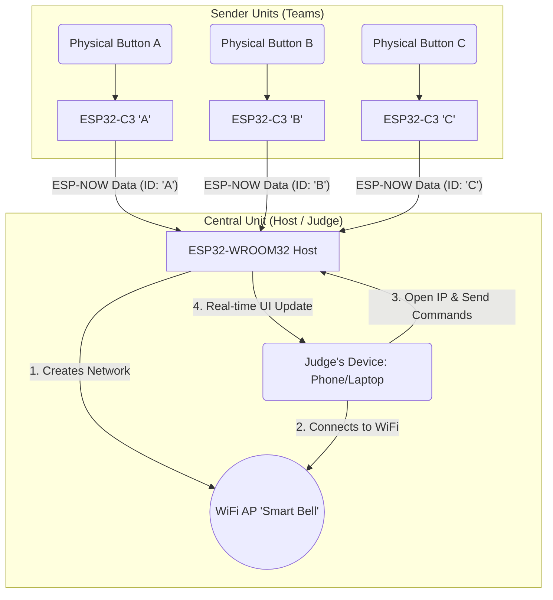
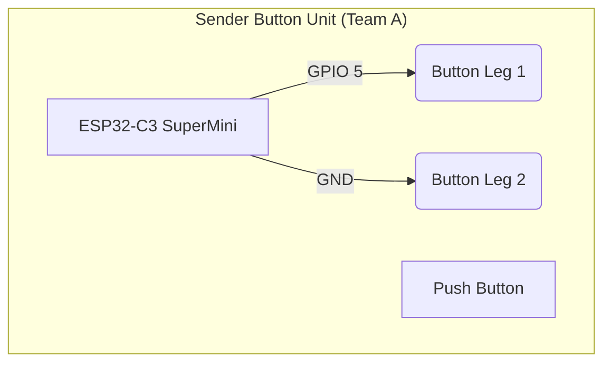

# 🔔 Real-Time Wireless Quiz Buzzer (ESP-NOW)

A wireless quiz buzzer system built on the ESP32 platform, utilizing the ultra-fast ESP-NOW protocol for reliable, low-latency communication.  
This project features a real-time, web-based judge interface powered by WebSockets, ensuring fair, millisecond-accurate scoring for any game show or trivia competition.

This project is designed to solve the problem of subjectivity and human error in determining who pressed the button first, with millisecond-level precision.

---

## ✨ Key Features

| Feature                     | Description |
|----------------------------|-------------|
| Ultra-Low Latency          | Uses ESP-NOW for instant communication (<10ms) without WiFi connection delays or TCP/IP handshakes. |
| Real-Time Judge Interface  | The judge's control panel gets updates in real time using WebSockets. No page refresh needed. |
| Universal Access           | Judge can use any browser on any device (phone, laptop) connected to the Host's WiFi AP. |
| High Accuracy              | System objectively determines one winner with millisecond precision, eliminating debates. |
| Low Cost                   | Built using affordable and widely available components. |
| Simple Setup               | No external router required — the Host acts as an AP ("Smart Bell"). |

---

## 💡 Concept & How It Works

The core idea is to separate the "Button" (Sender) from the "Brain" (Host).

### 1. Button Unit (Sender) — The "Dumb" Device
| Property         | Value                                                                 |
|------------------|-----------------------------------------------------------------------|
| Hardware         | ESP32-C3 SuperMini                                                    |
| Responsibility   | When the physical button is pressed, immediately send a packet via ESP-NOW (e.g. ID `'A'`). |
| WiFi Connection  | None. The Sender does **not** join any WiFi network.                 |
| Knowledge of Game State | None. It doesn't know who already won.                       |
| Why It's Fast    | No TCP/IP, no HTTP, just raw ESP-NOW broadcast to Host MAC.           |

### 2. Central Unit (Host) — The "Smart" Device
| Property           | Value                                                                                  |
|--------------------|----------------------------------------------------------------------------------------|
| Hardware           | ESP32-WROOM32                                                                          |
| Responsibility #1  | Listen for ESP-NOW packets from all Senders.                                           |
| Responsibility #2  | Decide the winner (first press wins), then lock the round to ignore late presses.     |
| Responsibility #3  | Act as WiFi AP (`"Smart Bell"`) and serve a web dashboard + WebSocket for the judge.  |

---

## 🔧 System Architecture

The project uses a **Star Network Topology**:

- The Host (ESP32-WROOM32) acts as the center.
- All Sender units (ESP32-C3) transmit directly to the Host using ESP-NOW.
- The Judge connects to the Host's Access Point over WiFi and controls the round.


# 🛠️ Hardware Requirements

| No. | Component              | Qty | Est. Unit Price (IDR)           | Notes                          |
|-----|------------------------|-----|----------------------------------|--------------------------------|
| 1   | ESP32-C3 Super Mini    | 3   | Rp 60.000                        | For 3 Sender Button units      |
| 2   | ESP32-WROOM32 DevKit  | 1   | Rp 300.000 (can be cheaper)      | For 1 Host / Server unit       |
| 3   | Push Button            | 3   | Rp 5.000                         | Physical button for each Sender|
| 4   | Pin Headers            | 4   | Rp 10.000                        | Connectors                     |
| 5   | Misc (wires, board, etc) | - | Rp 50.000                        | Jumper wires, protoboard, etc. |

**Total Estimated Cost:** ~Rp 585.000

---

# 🔌 Hardware Design (Wiring)

## Host Unit (ESP32-WROOM32)

| Signal / Pin | Connection       |
|--------------|------------------|
| 5V / 3V3 / GND | Power via USB cable |
| GPIOs        | (None needed for basic demo) |
| Extra Peripherals | Not required |

> Just power it via USB.  
> It will create WiFi AP + run the judge UI + receive ESP-NOW packets.

---

## Sender Unit (ESP32-C3)

> Very simple, no external resistor needed.

| Sender Part       | Connects To                          |
|-------------------|--------------------------------------|
| Push Button Leg 1 | GPIO 5 (or pin defined in code)      |
| Push Button Leg 2 | GND                                  |
| Power             | Via USB or battery                   |
| Internal Pull-up  | Yes (`INPUT_PULLUP` in firmware)     |

**In code:**
```cpp
pinMode(BUTTON_PIN, INPUT_PULLUP);
// Button press is detected when the pin reads LOW.
```


# Software Setup (PlatformIO)

This project is intended to be compiled and flashed using PlatformIO (PIO) inside **VS Code**.

---

## 📁 Project Layout (Recommended Workspace)
```
your-workspace/
├─ Quiz_Buzzer_Host/
│ ├─ src/
│ │ └─ main.cpp
│ └─ platformio.ini
└─ Quiz_Buzzer_Sender/
├─ src/
│ └─ main.cpp
└─ platformio.ini
```

---

## ⚙️ PlatformIO Environment Config

### `Quiz_Buzzer_Host/platformio.ini`

> Host runs **WiFi AP**, **WebSocket server**, **ESP-NOW receiver**.

```ini
[env:esp32dev]
platform = espressif32
board = esp32dev
framework = arduino
lib_deps =
    bblanchon/ArduinoJson@^6.19.4
    esphome/ESPAsyncWebServer-esphome@^3.0.0
monitor_speed = 115200
```
## 🔧 System Architecture

The project uses a **Star Network Topology**:

- The Host (ESP32-WROOM32) acts as the center.
- All Sender units (ESP32-C3) transmit directly to the Host using ESP-NOW.
- The Judge connects to the Host's Access Point over WiFi and controls the round.


esp 32c3 platform.ini
```ini
[env:esp32-c3-devkitm-1]
platform = espressif32
board = esp32-c3-devkitm-1
framework = arduino
monitor_speed = 115200
```
### Bagian 2: Proses Flashing (Ringkasan Tabel)

Ini adalah bagian heading dan tabel ringkasan langkah. Format tabel di Markdown menggunakan `|` (pipa) dan `-` (setrip).

## 🔁 Flashing & Pairing Process

This sequence matters because the Sender must know the Host's MAC address.

### 📝 Step Overview

| Step | Action | Device | Output / Goal |
| :--- | :--- | :--- | :--- |
| 1 | Flash Host firmware (`Quiz_Buzzer_Host/src/main.cpp`) | ESP32-WROOM32 (Host) | Host boots, starts AP, prints MAC address |
| 2 | Read MAC address from Serial Monitor (115200 baud) | ESP32-WROOM32 (Host) | Get Host's ESP-NOW / AP MAC |
| 3 | Paste that MAC into the Sender code (`broadcastAddress[]`) | ESP32-C3 (Sender) | Sender knows where to send packets |
| 4 | Set a unique team ID (`TEAM_A`, `TEAM_B`, etc.) | ESP32-C3 (Sender) | Identify which team won |
| 5 | Flash each Sender with personalized firmware | ESP32-C3 units | All Senders report to same Host with unique IDs |

### 🛠️ Detailed Instructions

#### ✅ Flash the Host
* Put the Host code (`main.cpp`) into `Quiz_Buzzer_Host/src/`
* Upload to ESP32-WROOM32

#### 🔍 Get Host MAC Address
* Open Serial Monitor at 115200
* Copy the printed MAC address

#### ✏️ Configure Each Sender
* Open `Quiz_Buzzer_Sender/src/main.cpp`
* Set `broadcastAddress` to the Host's MAC
* Set a unique team ID:
    ```cpp
    const char* TEAM_ID = "TEAM_A"; // or TEAM_B, TEAM_C, ...
    ```

#### 🚀 Flash Each Sender
* Upload code to each ESP32-C3
* All Senders now report to the same Host

### 🎮 How to Use (Operation Flow)

| Step | Actor | Action | Result |
| :--- | :--- | :--- | :--- |
| 1 | Setup | Power on all units (1 Host + all Senders) | Host boots AP + Web Server + WebSocket. Senders idle. |
| 2 | Judge | On phone/laptop, connect to `Smart Bell` WiFi | Judge joins Host's local network |
| 3 | Judge | Open browser &rarr; go to `http://192.168.4.1` | Judge Interface (control panel) loads |
| 4 | Judge | Press "START ROUND" in the UI | Unlocks system: `sistemTerkunci = false` |
| 5 | Contestants | Press physical buttons | First Sender sends ESP-NOW packet |
| 6 | Host FW | Detects 1st valid press, sets `sistemTerkunci = true` | Ignores further presses |
| 7 | Dashboard | Web UI auto-updates via WebSocket | Shows "WINNER: A", triggers sound |
| 8 | Judge | Press "RESET" in UI | System unlocks for next round |

### 🚧 Current Limitations & Weaknesses

| Limitation | Details |
| :--- | :--- |
| **Security** | WiFi AP is open (no WPA2). Use only in controlled environments. |
| **No Logging** | No persistent match log. Resetting Host clears history. |
| **Range** | ~100–200m line-of-sight. Walls reduce range. |
| **Power** | Units expect continuous USB/battery. No deep sleep optimization. |
